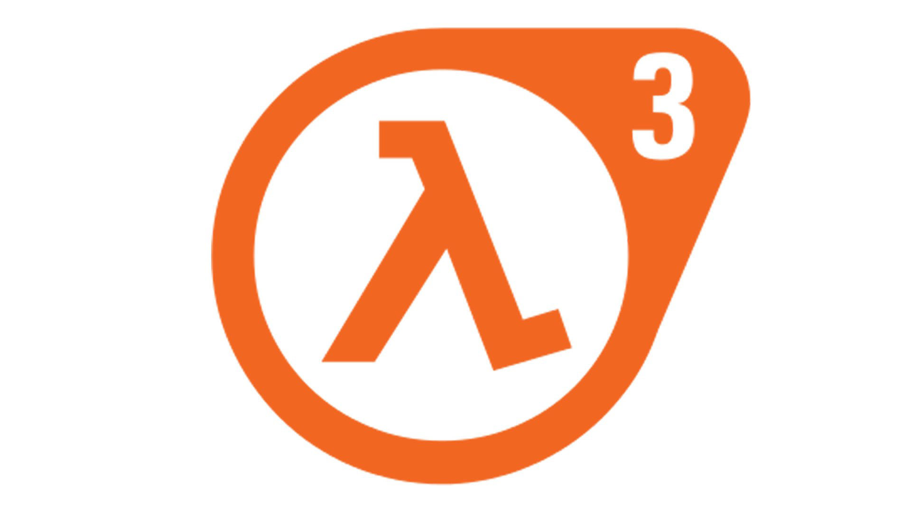
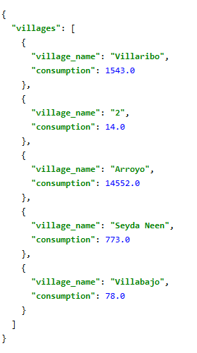
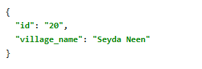

# Demo Meter

> A project assignment with the purpose of implementing counter for meters solution 

The project is a
 - Cloud-native application based on
    - AWS lambda
    - Dynamo DB
    - API Gateway
 - Deployed using terraform
 - With enabled CICD workflow provided by [CircleCI](https://circleci.com)

[](https://circleci.com/gh/azurefireice/demo-meter-counter/tree/master)

***Example response from API***

    Consumption report:

[]()

    Village Info:

[]()

---

## Table of Contents

- [Installation](#installation)
- [Features](#features)
- [What could be improved](#What could be improved)
- [Team](#team)
- [License](#license)

---

## Installation

- All CICD deployment instructions are contained in [config.yml](.circleci/config.yml)
- Set up AWS credentials in circleci project settings
- Enable usage of 3-rd party orbs
- You are ready to go

### Clone

- Clone this repo to your local machine using `https://github.com/azurefireice/demo-meter-counter`

### Setup

The project was developed in Intellij Idea IDE. In order to build and deploy it locally, you will need:

- Java 1.8
- Maven
- AWS-CLI
- Terraform

> Build each module with maven

```shell
$ mvn package
```

1. Create s3 bucket and DynamoDB table manually before doing terraform init. Please create main index for table called "LockID'
specify it in [main.tf](terraform/main.tf)
    ```hcl-terraform
    terraform {
      backend "s3" {
        bucket = <BUCKET_NAME>
        dynamodb_table = <TABLE_NAME>
        ...
    ```
2. Run terraform deployment scripts from terraform folder:
    ```shell
    $ cd terraform
    $ terraform init
    $ terraform validate
    $ terraform plan
    $ terraform apply -auto-approve
    ```

Use the produced endpoint to issue commands e.g.:

Intellij http snippet:
```HTTP
POST https://l7dgftd3ja.execute-api.us-east-2.amazonaws.com/demo/electricity_counter/counter_callback

{"counter_id": "1","amount": 10}
```

---

## Features

## Usage (Optional)
Deployment provides set of endpoints:
Please see [http-api-scratch.http](http-api-scratch.http) for some reference
(Don't forget to replace the "l7dgftd3ja" part)
    
- POST ../electricity_counter/counter_callback  
    Allows posting counter info with data like this: {"counter_id": "1","amount": 10}


- GET ../electricity_counter/counter?id=1
     Returning info about coutner in form: {"id": "1", "village_name": "Villariba"}
 
 
- GET ../electricity_counter/consumption_report?duration=13h
    Returning consumption report in form: 
    ```json
    { 
      "villages": [
        {"village_name": "Villarriba", "consumption": 12345.123},
        {"village_name": "Villabajo", "consumption": 23456.12}
      ]
    }
    ```
   Duration is a period for which retrieve data. It can be specified like:
    - "1m" - 1 minute
    - "10h" - 10 hours
    - "8D" - 8 days
    - "3M" - 3 months
    - "10Y" - 10 years

## What could be improved
Due to time limitations, only essential functionality was implemented.

At the current state there are lot of improvements that can be done. Here are some of them:

1. Authorization/Authentication, Security, VPC.
2. E2E Tests, More unit tests
3. Code deduplication in
    1. Java code
    2. Maven configs
    3. Terraform configs
    4. CircleCI config
4. Lambda
    1. Reduce deployment size
    2. Introduce Layers
    3. Introduce Dependency Injection
    4. "Serverless" framework
5. DynamoDB
    1. Biggest issue is generating report. Currently it is implemented as plain scan of table with joining with other table.
    This introduces bottleneck when data starts to grow. Solution here is using **CQRS** approach to *stream* and *aggregate* data
    to denormalized form, this way report retrieval time will be constant.
    2. More refined codebase in lambda with DynamoDB SDK
6. Local / Staging environment
7. Multi region
8. Proper exception handling on API side
9. Add CRUD or management for villages, as currently they are static and introduce consistency issue
    (it is possible to get report with only counter id, not a name in it)


## Team

> Andrii Gryshchenko


 []() 

---

## License

[](https://opensource.org/licenses/GPL-3.0)

- **[GPL-3.0 license](LICENSE)**

- Copyright 2019 © Andrii Gryshchenko